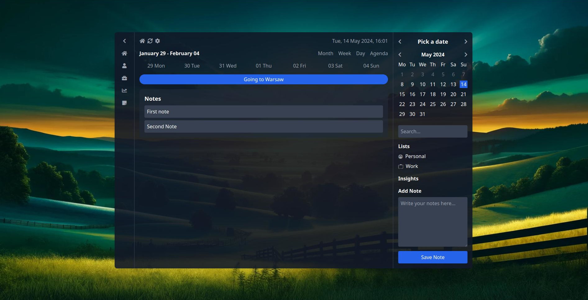

# Interactive Calendar GUI

This project is an interactive calendar application with note-taking functionality, developed using HTML, CSS (Tailwind CSS), and JavaScript. The application features a responsive design with a collapsible sidebar, calendar navigation, and a section to add and display notes. This application (and this text) was created using multimodal large language models (LLMs), including the new 4o model, based on image captures and iterative prompting.




## Features

- **Interactive Calendar**: View and navigate through different dates.
- **Collapsible Sidebar**: Icon-based sidebar that can be expanded or collapsed.
- **Current Date and Time**: Automatically updates to display the current date and time.
- **Note Taking**: Add, view, and store notes locally in the browser.
- **Responsive Design**: Optimized for various screen sizes.

## Installation

1. Clone the repository:

   ```bash
   git clone https://github.com/yourusername/interactive-calendar-gui.git
   ```

2. Navigate to the project directory:

   ```bash
   cd interactive-calendar-gui
   ```

3. Open the `index.html` file in your preferred web browser.

## Usage

- **Toggle Sidebar**: Click the chevron icon to expand or collapse the sidebar.
- **Navigate Calendar**: Use the chevron icons to navigate through months.
- **View Current Date**: The current date and time are displayed and updated every minute.
- **Add Notes**: Enter your notes in the text area and click the "Save Note" button to store them locally.
- **View Notes**: Saved notes are displayed in the "Notes" section and persist across sessions using local storage.

## Technologies Used

- **HTML**: For structuring the application.
- **Tailwind CSS**: For styling and responsive design.
- **Font Awesome**: For icons.
- **JavaScript**: For interactivity and functionality.
- **Local Storage**: For persisting notes across sessions.

## Contributing

Contributions are welcome! If you have suggestions for improvements or encounter any issues, please open an issue or submit a pull request.

1. Fork the repository.
2. Create a new branch (`git checkout -b feature/YourFeature`).
3. Commit your changes (`git commit -am 'Add some feature'`).
4. Push to the branch (`git push origin feature/YourFeature`).
5. Open a pull request.

## License

This project is licensed under the MIT License. See the [LICENSE](LICENSE) file for details.

---

This interactive calendar GUI was generated using multimodal large language models (LLMs), including the new 4o model, based on image captures and iterative prompting. It is a work in progress, and we appreciate any feedback or contributions to enhance its functionality and user experience.
